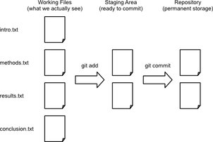

# Introduction

# Outline

Version control

* What
* Why
* How (`git`)

# Version control

# Version control - *What* (not)


# Version control *What*

*The modern scientist's lab notebook*

* Keep track of changes in a project *as the occur*
* Document the changes
* Archive the history in a way that allows to easily roll back 
* Tell differences with other versions (collaboration) and be able to merge
  them

# *Version control Why*

* **Sanity**: nothing "committed" is lost
* **Archival**: keep record on when what changed how
* **Collaboration**: work simultaneously with colleagues, properly merge and manage conflicts

Very [neat video](http://flowingdata.com/2012/11/30/time-lapse-writing-of-a-research-paper/) exemplifying the concept

# `git`

Today:

* Set up a new project
* Track changes as you work
* Examine the change history
* Compare different versions
* Restore old versions of a file
* Other tricks to better manage your `git` project

Not today (but you should check it out):

* [Collaboration](http://software-carpentry.org/v5/novice/git/02-collab.html) with `git`
* [Conflicts](http://software-carpentry.org/v5/novice/git/03-conflict.html) in `git`

# `git` - Requirements & Setup

Assuming you have `git` installed:

```
$ git config --global user.name "Your Name"
$ git config --global user.email "your@email.org"
```

These are for attribution purposes only, it does not sign you up for any
service

Additionally, you may want to set up a default editor (make sure you actually
have it installed):

```
git config --global core.editor "vim" 
```

Additional trick:

```
$ git config --global --add color.ui true
```

# `git` - New project (repository)

Navigate to the folder where you want to create the new project and create the
directory, naming it the way you prefer:

```
$ cd /path/to/folder
$ mkdir my_new_folder
$ cd my_new_folder
```

Then start tracking:

```
$ git init
```

# `git` - New project (repository) (cnt.)

This will create a hidden folder called `.git`, which will story all the
history (although you will never access it directly).

A very common command you will use repeatedly is `status`:

```
$ git status

# On branch master
#
# Initial commit
#
nothing to commit (create/copy files and use "git add" to track)
```

# `git` - Work...

Start, for example, with one text file. You can create it from the text editor
of your preference, or you can create it using a command line editor, such as
`vim`:

```
$ vim nobelp_paper.txt
```

And start working:

```
The world is flat.
```

# `git` - Work... (cnt.)

Take a break. Save and quit the file. And now check the status of the `git`
project:

```
$ git status

# On branch master
#
# Initial commit
#
# Untracked files:
#   (use "git add <file>..." to include in what will be committed)
#
#	nobelp_paper.txt
nothing added to commit but untracked files present (use "git add" to track)
```

# `git` - ... and track your work!

At this point, you want `nobelp_paper.txt` to be tracked as you work on it.
This does *not* come automatically (like in Dropbox, for example), but you
need to explicitly add the file:

```
$ git add nobelp_paper.txt
```

Now `git` knows it has to keep an eye on the file:

# `git` - ... and track your work! (cnt.)

```
$ git status

# On branch master
#
# Initial commit
#
# Changes to be committed:
#   (use "git rm --cached <file>..." to unstage)
#
#	new file:   nobelp_paper.txt
#
```

To record the file at a given stage, you need to "commit" the changes. Include
a (short) message describing the advancement:

```
$ git commit -m "Current state of knowledge about Earth"
```

Everything is properly recorded at this point.

# `git` - Why `add` and `commit`?



(Source: [Software Carpentry](http://software-carpentry.org/v5/novice/git/img/git-staging-area.png))

# `git` - Why `add` and `commit`? (cnt.)

```
$ git status

# On branch master
nothing to commit, working directory clean
```

It means you could keep working, not add, and, when you commit, only the added
version will be tracked. Very useful when a project has **many files**!

# `git` - Work, track, work, track...

```
$ vim nobelp_paper.txt
```

```
The world is NOT flat.
```

```
$ git status

On branch master
Changes not staged for commit:
  (use "git add <file>..." to update what will be committed)
  (use "git checkout -- <file>..." to discard changes in working directory)

	modified:   nobelp_paper.txt

no changes added to commit (use "git add" and/or "git commit -a")
```

# `git` - Work, track, work, track... (cnt.)

Since the file is under tracking already, you can `add` and `commit` in a
single shot:

```
$ git commit -am "Correcting view about Earth"

[master a643fa0] Correcting view about Earth
 1 file changed, 1 insertion(+), 1 deletion(-)
```

Repeat this process as many times as snapshots you want to record of your
project.

# `git` - Examine log

```
$ git log

commit a643fa0ca03291793cb432d799defd0f496b5c9a
Author: Dani Arribas-Bel <daniel.arribas.bel@gmail.com>
Date:   Thu Aug 28 10:50:01 2014 -0500

    Correcting view about Earth

commit 6d119ff4a319650bfef06d279b000a56f5fe7759
Author: Dani Arribas-Bel <daniel.arribas.bel@gmail.com>
Date:   Thu Aug 28 10:36:36 2014 -0500

    Current state of knowledge about Earth
```

# `git` - Examine log (cnt.)

Or a more compressed view...

```
$ git log --pretty=oneline

a643fa0ca03291793cb432d799defd0f496b5c9a Correcting view about Earth
6d119ff4a319650bfef06d279b000a56f5fe7759 Current state of knowledge about Earth
```

Or more detailed:

```
$ git log --pretty=format:"%h - %a, %ar : %s"

a643fa0 - %a, 17 minutes ago : Correcting view about Earth
6d119ff - %a, 30 minutes ago : Current state of knowledge about Earth
```

See more details about tweaking `git log` in [this link](http://www.git-scm.com/book/en/Git-Basics-Viewing-the-Commit-History).

# `git` - Compare versions

Current version from last one tracked (`HEAD`):

```
$ vim nobelp_paper.txt
```

```
The world is NOT flat at all.
```

```
$ git diff

diff --git a/nobelp_paper.txt b/nobelp_paper.txt
index 5a35641..3215244 100644
--- a/nobelp_paper.txt
+++ b/nobelp_paper.txt
@@ -1 +1 @@
-The world is NOT flat.
+The world is NOT flat at all.
```

# `git` - Compare versions (cnt.)

You can go back in time n revisions (`HEAD~n`):

```
$ git commit -am "Reaffirming myself about Earth's non-flatness"
```

```
$ git diff HEAD~2 nobelp_paper.txt

diff --git a/nobelp_paper.txt b/nobelp_paper.txt
index 3fa4573..3215244 100644
--- a/nobelp_paper.txt
+++ b/nobelp_paper.txt
@@ -1 +1 @@
-The world is flat.
+The world is NOT flat at all.
```

# `git` - Compare versions (ctd.)

Or compare with a specific revision (check log for that):

```
$ git diff 6d119ff nobelp_paper.txt

diff --git a/nobelp_paper.txt b/nobelp_paper.txt
index 3fa4573..3215244 100644
--- a/nobelp_paper.txt
+++ b/nobelp_paper.txt
@@ -1 +1 @@
-The world is flat.
+The world is NOT flat at all.
```

# `git` - Compare versions (cnt.)

Or compare two previous versions:

```
$ git diff 6d119ff a643fa0 nobelp_paper.txt

diff --git a/nobelp_paper.txt b/nobelp_paper.txt
index 3fa4573..5a35641 100644
--- a/nobelp_paper.txt
+++ b/nobelp_paper.txt
@@ -1 +1 @@
-The world is flat.
+The world is NOT flat.
```

# `git` - Restore older version

Suppose we delete the file by accident:

```
$ rm nobelp_paper.txt
```

Bringing the last version back is straightforward:

```
$ git checkout HEAD nobelp_paper.txt
```

Also works if you decide to go back to a previous version of the file:

```
$ git checkout HEAD~2 nobelp_paper.txt
```

# `git` - Restore older version (cnt.)

These modifications act as if you had edited the file:

```
$ git status

On branch master
Changes to be committed:
  (use "git reset HEAD <file>..." to unstage)

	modified:   nobelp_paper.txt

```

So if you want to save the project at that stage again, commit:

```
$ git commit -am "Going back to original ideas"
```

# `git` - Several files

* `git` tracks "**snapshots**" of the project, rather than changes in particular
files.
* Extending this process to several files in the project is straightforward
* The previous workflow favors keeping things organized in **different
files**. Although you can manage everything in one master file, having the
sections of a paper split into different files makes going back and forth 
in time much easier and flexible.

# Exercise

* Create a new file with some text and include in the tracking.
* Make a change in the file and commit it.
* Bring the project to a state where `nobelp_paper.txt` is in the initial
  version and the new file is at the latest.

# Exercise (suggested) result

```
$ vim corollary.txt
```

```
I am not really sure about Earth's flatness.
```

```
$ git add corollary.txt
$ git commit -am "Adding corollary"
```

```
$ vim corollary.txt
```

```
I am not really sure about Earth's flatness, it depends.
```

```
$ git commit -am "Introducing uncertainty to corollary"
```
# Exercise (suggested) result (cnt.)
```
$ git log --pretty=oneline nobelp_paper.txt

25acad2069d72947e5aa2e21ddfe4509205ded88 Going back to original ideas
cfccca975f95ba6588ce07360f4507d5a796b20a Reaffirming myself about Earth's non-flatness
a643fa0ca03291793cb432d799defd0f496b5c9a Correcting view about Earth
6d119ff4a319650bfef06d279b000a56f5fe7759 Current state of knowledge about Eart

$ git checkout 6d119ff4a319650bfef06d279b000a56f5fe7759 nobelp_paper.txt
$ git commit -am "Completing exercise"
```

# `git` - Get selective on a project

* A project might have several files (we've seen how to deal with that)
* Some of those you might prefer to exclude (or not care to include)
* By default they will not be tracked
* You can create a `.gitignore` file in the root folder listing files to be
  explicitly excluded from tracking

```
$ vim .gitignore
$ git add .gitignore
$ git commit -m "Adding ignore file"
```
# `git` - Get selective on a project (cnt.)

```
*.aux
```

```
$ vim something.aux
```

```
$ git status

On branch master
nothing to commit, working directory clean
```

# 


Content by [Dani Arribas-Bel](http://darribas.org) and [Thomas De Graaff](http://www.thomasdegraaff.net/),
licensed under [Creative Commons Attribution 4.0 International License](http://creativecommons.org/licenses/by/4.0/).

For this session, we have borrowed important amounts of inspiration and material from **Software Carpentry**'s [session on git](http://software-carpentry.org/v5/novice/git/index.html) and the freely available book [Pro Git](http://www.git-scm.com/book/)

