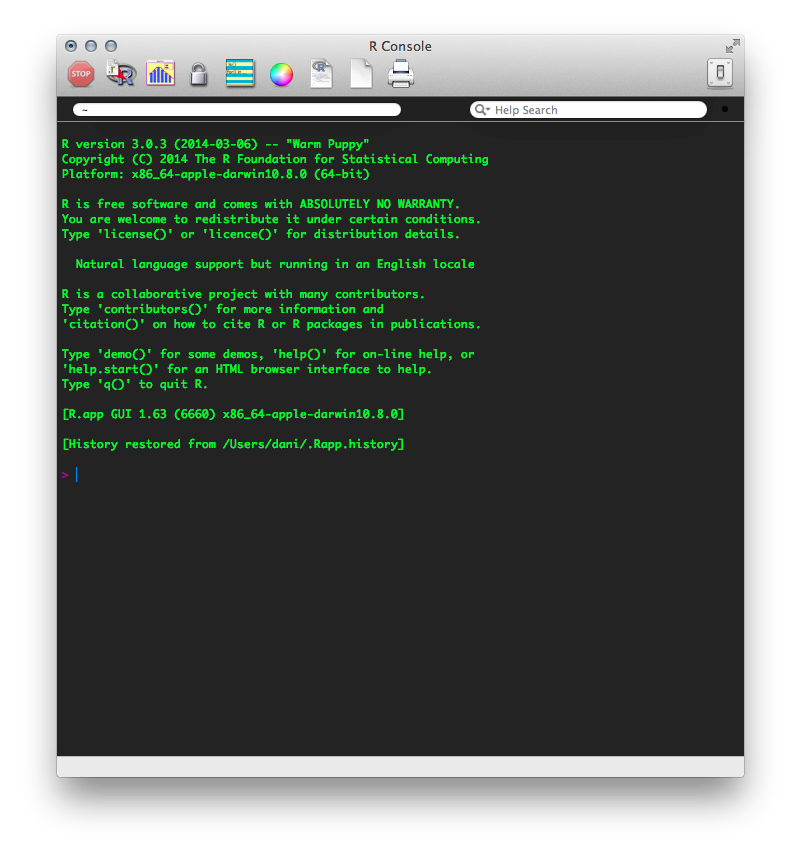
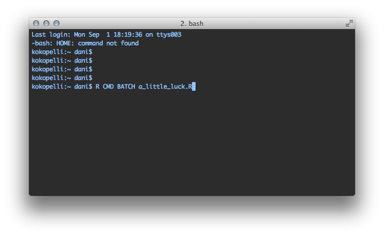
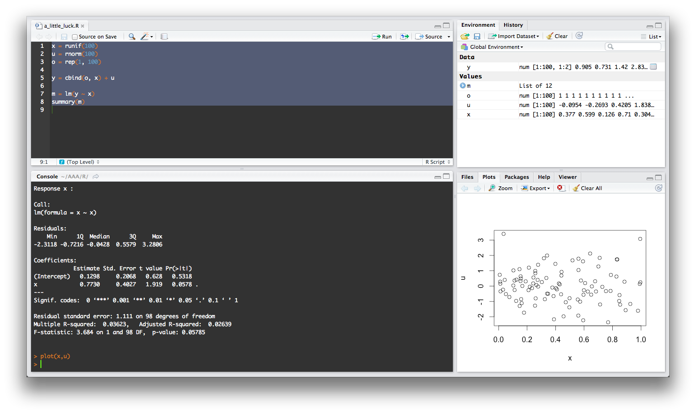

# Outline

## Today

* Reproducible statistical analysis
* Reinhart & Rogoff: a textbook example of the power of replication
* `R`: what is it and why should I care?
* `R` overview
    * Libraries and help
    * Reading data
    * Exploring the `data.frame`
    * Manipulate a `data.frame`
    * Analyze data
    * Visualize data
    * Export results

# Introduction

## Reproducible statistical analysis

Open principles applied to the way you conduct
statistical data analysis:

* Make the process explicit and transparent
* Provide every input required to reproduce the analysis carried out
  and obtain the same results, as reported in the final document published

This typically involves three levels:

* **Data** used for the study
* **Code** created to perform the analysis
* **Platform** required to run the code

Being fully open on the three is not always possible (e.g. proprietary
data/software), but that should be goal to which to get as close as
possible. 

*Getting halfway is better than not starting*

In this session we will focus on the last two: **code** and **platform**

## Reinhart & Rogoff

* In 2010, C. Reinhart and K. Rogoff put together a paper claiming to show
  how economic growth is seriously dampened once the ratio of debt to GDP goes
  above 90%
* The paper was very influential and became one of the most commonly cited
  ones to argue for austerity measures
* In 2013, **Thomas Herndon**, a PhD student at UMass, tried
  to replicate the results for a class assignment
* He could not, so finally he obtained from Reinhart the original (Excel) code
  and data only to find **results diverged** because of:
    * Selective exclusion of available data
    * Unconventional weighting of summary statistics
    * Coding errors
* The **replication** is posted [online](http://www.peri.umass.edu/236/hash/31e2ff374b6377b2ddec04deaa6388b1/publication/566/), together with the data and R code used for
  the paper

## Reinhart & Rogoff

Lessons:

* **No one is free from mistakes** (even Harvard top economists!)
* **Posting your data and code** but, if you don't, sharing them honestly upon
  request is a good second best
* **Replication** should be much more widespread
* ... you should not underestimate PhD students without a big name but with lots
  of time!

# `R`
## `R`: what is it?

*R is a language and environment for statistical computing and graphics*

* **language & environment**
* **statistical computing**
* **graphics**

Characteristics:

* It is a Free implementation of the `S` language created by **R**oss Ihaka and **R**obert Gentleman in 1993
* **Cross-platform**: runs on many \*nix (included Linux) systems, Windows and MacOS. 
* It is licensed under GPL, which makes it **free**...
    * ... as in **beer**
    * ... as in **speech**

##Why should I care about R?

* Philosophy behind the project
* Convenience (once you get ahead the learning curve)

Some people who care about R:

* Many top universities use R in teaching and research
* [Google and Facebook](http://www.dataspora.com/2009/02/predictive-analytics-using-r/)
* [New York Times](http://www.nytimes.com/2009/01/07/technology/business-computing/07program.html?pagewanted=all)

## The R Philosophy

*...Then sit back, relax, and enjoy being part of something big...* 
[[Tom Preston-Werner](http://tom.preston-werner.com/2011/11/22/open-source-everything.html)]

Being Free Software ("the users have the freedom to run, copy, distribute, study, change and improve the software") has enhanced:

* **Worldwide community** of dedicated and enthusiastic users, contributors and developers that:
    * Lowers the entry barriers (mailing lists, blog posts, online
      tutorials, workshops...)
    * Continuously expands the capability and functionality
* Becoming an instrument for **democratization** of academic software and technology transfer
* Becoming the **lingua franca** in academia 
* Facilitating [reproductibility and Open Science](http://arstechnica.com/science/news/2012/02/science-code-should-be-open-source-according-to-editorial.ars)

## R as free beer

* The price is right
    * Education
    * Installation across multiple machines
* The *beer selection* is wide (CRAN hosts 3,669 available packages as of March 10th. 2012)
    * Makes R a good one stop-shop and a good investment of your time to learn
      it
    * No market profitability constraints put it at the cutting edge (research
      sandbox)
* Linus' Law: *"given enough eyeballs, all bugs are shallow"*
    * More reliable and stable

## Ways to interact with `R`

* Interactive shell



## Ways to interact with `R`

* Batch mode from the command line



## Ways to interact with `R`

* IDEs (e.g. RStudio)



# `R` overview

## Packages
**Look for R info and packages**

* Project website: [http://r-project.org](http://r-project.org)
* The Comprehensive R Archive Network ([CRAN](http://cran.r-project.org/))
* The [R-Journal](http://journal.r-project.org/) (and [JoSS](http://www.jstatsoft.org/))
* [R bloggers](http://www.r-bloggers.com/)
* Twitter: the `#rstats` hashtag
* Google (good luck on that)

**Install and load packages**

* Windows and MacOS GUIs have installers
* Command line with `instal.packages` function
* Command `library` (e.d. `library(maptools)` to load the package `maptools`)

## Help


## Help and documentation

* R built-in search capability

---------------------------------------------------------------------------
        Command                             Function
----------------------------   --------------------------------------------
`?read.csv`                    Check local documentation for `read.csv`
                               function

`spdep::moran.test`            Check local documentation in package 
                               `spdep` for `moran.test`

`help("read.csv")`             Check local documentation for `read.csv`
                               function

`help.search("read.csv")`      Search for "read.csv" in all help files

`RSiteSearch("plot maps")`     Search for the term "plot maps" in the
                                RSiteSearch website (requires connectivity)
---------------------------------------------------------------------------

* [StackOverflow](http://stackoverflow.com/questions/tagged/r)

## Reading data

Point to the folder

```{r}
setwd('~/code/WooWii/slides/')
getwd()
```

Native `csv` reading

```{r}
nl <- read.csv("../Paper/Final/Data/RR - Netherlands.csv")
```

Foreign formats supported

```{r}
library(foreign)
proc <- read.dta("../Paper/Final/Data/RR-processed.dta")
```

Many other formats supported (`dbf`, `xls`, `sql`-like databases...)

## Exploring a `data.frame`

`head`/`tail` for the top/bottom of the table

```{r}
head(nl)
```

```{r}
nl[1, ]
```

## Exploring a `data.frame`

```{r}
max(nl$GDP1, na.rm=TRUE)
```

```{r}
min(nl$Debt, na.rm=TRUE)
```

Create new variables

```{r}
nl['dtg'] = nl$Debt / nl$GDP1
```

## Exploring a `data.frame`

`summary` for basic statistics

```{r}
summary(nl)
```

## Querying a `data.frame`

A `data.frame` has fancy query features

```{r}
with_debt <- nl[!is.na(nl$Debt), ]
head(with_debt, 3)
```

```{r}
nl_clean <- nl[!is.na(nl$GDP1), ]
mean_gdp <- mean(nl_clean$GDP1)
high_gdp <- nl_clean[nl_clean$GDP1 > mean_gdp, ]
head(high_gdp, 3)
```

You could use `>` for greater than, `<` for smaller than, or `==` for equal to

## Querying a `data.frame`

Which you can combine:

```{r}
super_clean <- nl[(!is.na(nl$GDP1)) & (!is.na(nl$Debt)), ]
ratio <- super_clean$Debt / super_clean$GDP1
good_years <- super_clean[(ratio < 0.9) & (super_clean$GDP1 > mean_gdp), ]
head(good_years, 3)
```

## Hands on!

In `proc`: 

* In what country and year the GDP is largest?
* Show a country in which the Debt/GDP ratio has never been beyond 90%

## Answer

* In what country and year the GDP is largest?

```{r}
clean_gdp <- proc[!is.na(proc$GDP), ]
max_gdp <- max(clean_gdp$GDP)
top_gdp <- clean_gdp[clean_gdp$GDP == max_gdp, ]
top_gdp[, c('Country', 'Year', 'GDP')]
```

* Show a country in which the Debt/GDP ratio has never been beyond 90%

```{r}
proc['dtg'] <- 100 * proc$Debt / proc$GDP
debt_to_gdp_clean <- proc[!is.na(proc$dtg), ]
good_boys <- debt_to_gdp_clean[debt_to_gdp_clean$dtg < 0.9, ]
good_boys[1:5, c('Country', 'Year', 'dtg')]
```

```{r}
unique(good_boys$Country)
```

## Analyze data: regression

```{r}
ols <- lm('log(Debt) ~ log(GDP)', data=proc)
summary(ols)
```

## Visualization

```{r}
plot(log(proc$GDP), log(proc$Debt))
```

Try also `plot(ols)` in RStudio!

## Advanced manipulations

Corrected Reinhart & Rogoff Table 1 (as shown by Herndon et al.)

```{r}
RR$dgcat.lm <- cut(RR$debtgdp, breaks=c(0,30,60,90,Inf))
RR$dgcat <- factor(RR$dgcat.lm, labels = c("0-30%","30-60%","60-90%","Above 90%"),ordered=TRUE)
(RR.correct.mean <- with(RR, tapply( dRGDP, dgcat, mean, na.rm=TRUE )))
```

Converted to a `data.frame`

```{r}
table_df <- data.frame(RR.correct.mean, dgcat=names(RR.correct.mean) )
table_df
```

## Export results

Simply write to a `csv`

```{r}
write.csv(table_df, '~/Desktop/table.csv')
```

Or to LaTeX

```{r}
library(xtable)
xtable(table_df)
```

## Export results

If we wanted to write it out to a file

```{r results='hide'}
sink('~/Desktop/table.tex')
xtable(table_df)
sink()
```

